# Croco Angular Task

This is my completed Angular 19 project for the Croco Angular challenge.

The application demonstrates:

- A responsive, multi-page Angular app with **header, navigation, table, and footer**
- API integration with [JSONPlaceholder](https://jsonplaceholder.typicode.com/) to fetch users and posts
- Interactive components including a **wheel** and a **leaderboard**
- Filtering, searching, and animations for buttons and interactive elements

---

## Features

### Header
- Displays the site name (clickable to return to the main page)
- Shows the current date and time in the top-right corner

### Navigation
- Left-side menu with buttons for:
  - Users
  - Posts

### Users Table
- Columns: First Name, Last Name, Phone, Email, Company Name
- Each row has a **Posts** button:
  - Hover: simple animation
  - Click: navigates to the posts of that user

### Posts Table
- Columns: User Name, Post Title
- Each post has a **Details** button:
  - Opens a popup showing the full title and description
- Filtered by the user that was clicked

### Todo List (Optional)
- Each user row can navigate to their todo list
- Completed tasks are highlighted in green

### Promotions Page
- **Wheel component**
  - 10 numbered sectors (1–10)
  - Input a number to spin the wheel to that sector
  - Shows an error if the number is not 1–10
- **Leaderboard component**
  - Week filter buttons (I, II, III, IV, ALL)
  - Displays a list of user scores
  - Active filter visually highlighted

---

## Screenshots

## Screenshots

### Main Page
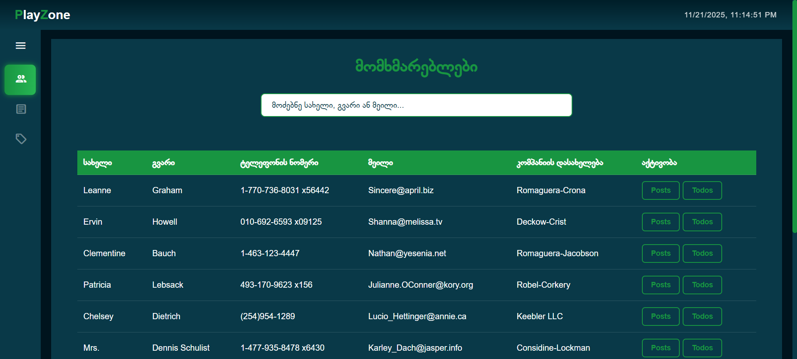

### Users Table
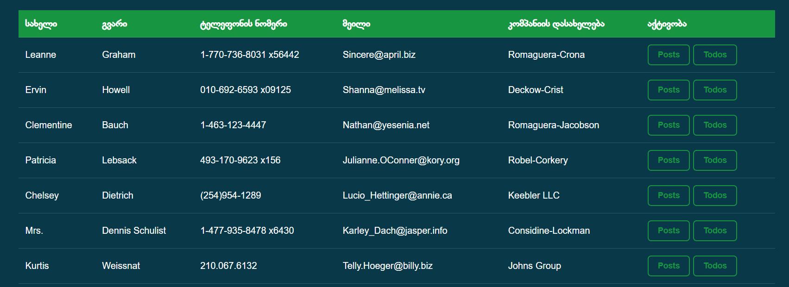

### All Posts
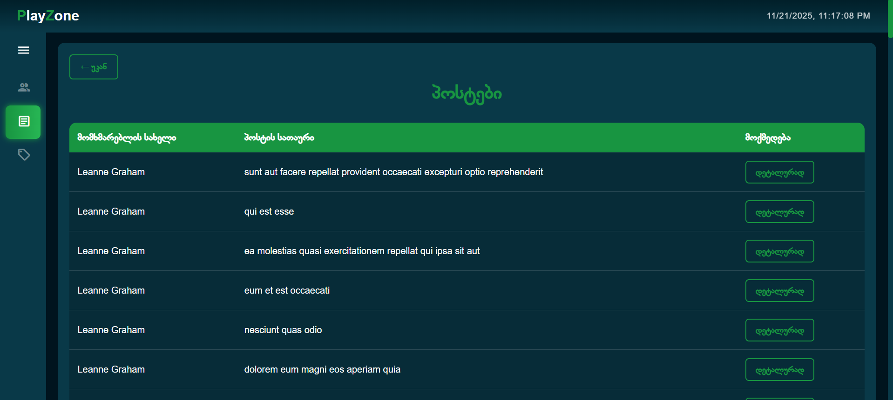

### User Posts
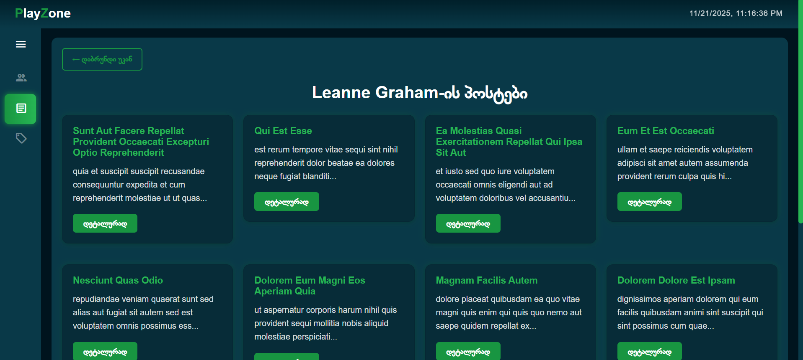

### Posts Page
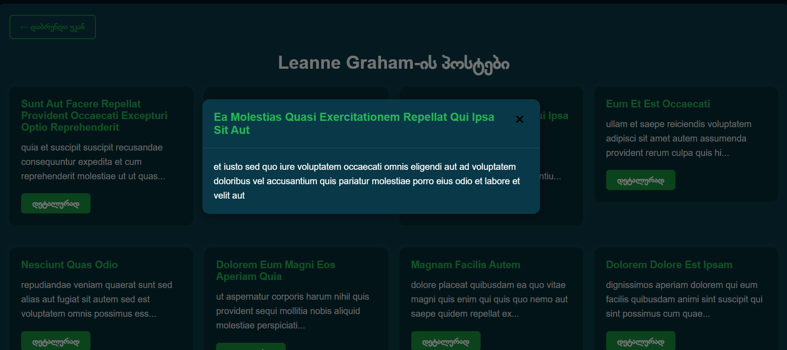

### Todos Page
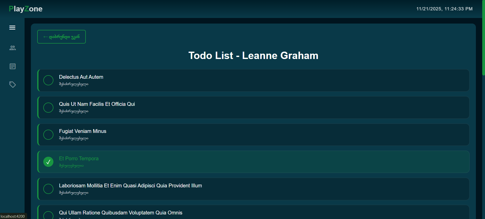

### Single Todo
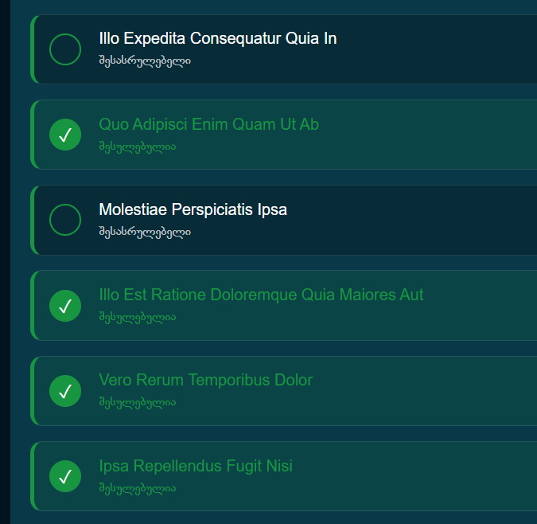

### Promotions Page
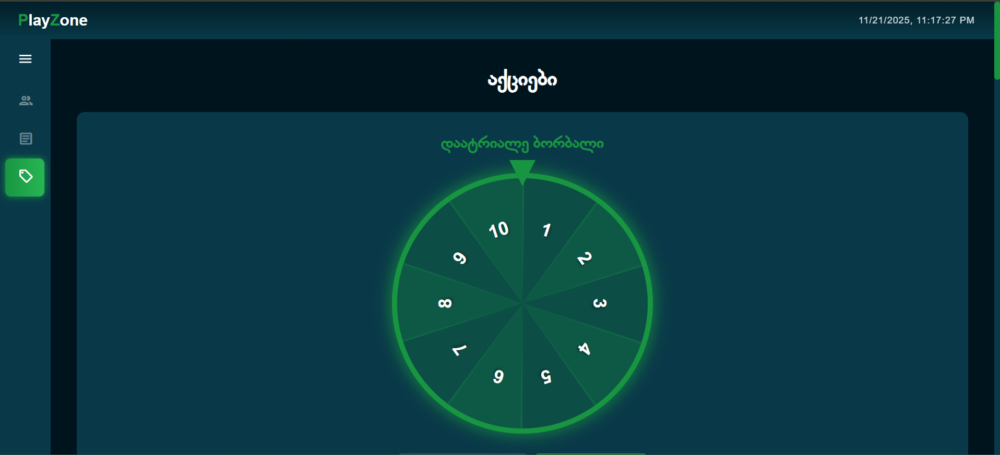

### Wheel Component
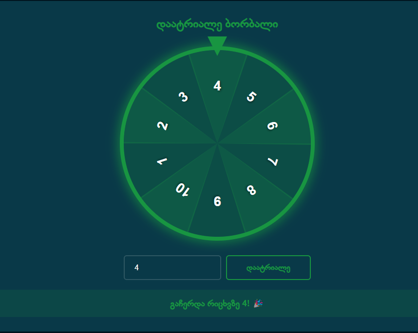

### Leaderboard

### Sidebar (Opened)
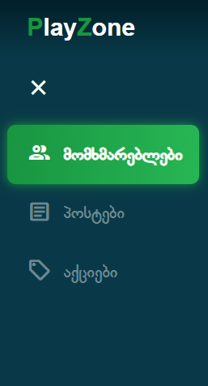

### Sidebar (Closed)
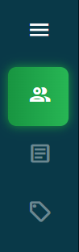
